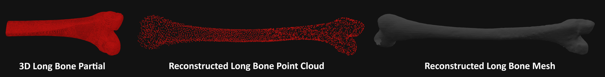

### <div align="center">3D Long Bone Reconstruction</div>
### <div align="center">(LMU - Excalibur)</div>
#### <div align="center">Paper accepted at GCH 2026</div>
# Overview
This project implements a point-cloud completion pipeline for long-bone reconstruction from partial 3D scans. The codebase is built around a SymmCompletion-style model and is configured for custom archaeological bone datasets, with dataset normalization, split generation, and online partial-crop generation handled inside the training pipeline.

<p align="center">
  
</p>

## Current repository layout
- `main.py`: training and evaluation entry point
- `prepare_custom_dataset.py`: create normalized bone dataset from raw OBJ meshes
- `create_custom_npy_global_norm.py`: alternate global-normalization dataset builder
- `augment_and_split_global.py`: generate train/val/test splits and augmented point clouds
- `cfgs/CustomBones_models/SymmCompletion.yaml`: model/training config for bone reconstruction
- `cfgs/dataset_configs/CustomBones.yaml`: dataset configuration, including path and point count
- `datasets/CustomBonesDataset.py`: custom dataset loader, partial crop generation, and online augmentation
- `extensions/`: compiled CUDA extensions for Chamfer, expansion penalty, KNN, and PointNet++

## Requirements

### System requirements
- Linux
- Python 3.11
- CUDA-enabled PyTorch build
- NVIDIA GPU with enough VRAM for training

### Python packages
The project installs the dependencies in `requirements.txt`, including:
- PyTorch and CUDA support
- `tensorboard` / `tensorboardX`
- `open3d`
- `numpy`, `scipy`, `scikit-image`
- `easydict`, `omegaconf`, `PyYAML`
- `transforms3d`, `plyfile`
- `trimesh` for mesh sampling prep

## Installation

### 1. Create a conda environment
```bash
conda create -n symmcompletion python=3.11
conda activate symmcompletion
```

### 2. Install PyTorch
Use the CUDA version that matches your system:
```bash
pip install torch torchvision torchaudio --index-url https://download.pytorch.org/whl/cu128
```

### 3. Install project dependencies
```bash
pip install -r requirements.txt
```

### 4. Build CUDA extensions
The extensions must be compiled from the project folder:
```bash
conda install ninja -c conda-forge

cd extensions/chamfer_dist
python setup.py build_ext --inplace

cd ../expansion_penalty
python setup.py build_ext --inplace

cd ../KNN_CUDA
python setup.py build_ext --inplace

cd ../Pointnet2/pointnet2
python setup.py build_ext --inplace
```

### 5. Configure the environment
Before training or testing, source the project environment script:
```bash
source setup_env.sh
```
This script adds the compiled extension paths to `PYTHONPATH` and adds the PyTorch CUDA library path to `LD_LIBRARY_PATH`.

## Dataset preparation

This repository expects a custom bone dataset stored under `datasets/CustomBones/`.

### Option A: Create a normalized dataset from raw OBJ files
This is the main script used for preprocessing bone meshes into `.npy` point clouds:
```bash
python prepare_custom_dataset.py
```

The script contains a default example configuration at the bottom of the file:
```python
OBJ_FOLDER = "<path to 3D models>"
OUTPUT_FOLDER = "./datasets/CustomBones/complete_global_norm_uniform_8k"
```
Update those paths before running it in a new environment.

### Option B: Alternative dataset builders
The repo also contains:
- `create_custom_npy_global_norm.py`
- `augment_and_split_global.py`

These are older or alternative dataset-prep scripts for the same workflow and may be useful depending on the exact preprocessing pipeline you want to reproduce.

## Expected dataset structure
The current training setup expects a folder like this:
```text
datasets/
└── CustomBones/
    ├── categories.json
    ├── train.txt
    ├── val.txt
    ├── test.txt
    ├── dataset_stats.json
    └── complete_global_norm_uniform_balanced/
        ├── 00000000/
        │   ├── 00000000-<sample_id>.npy
        │   └── ...
        ├── 00000001/
        │   └── ...
        └── 00000002/
            └── ...
```

## Training

The repo’s current training config is:
```bash
cfgs/CustomBones_models/SymmCompletion.yaml
```

### Basic training
```bash
source setup_env.sh
python main.py \
  --config cfgs/CustomBones_models/SymmCompletion.yaml \
  --exp_name CustomBones_experiment
```

### Resume training
```bash
source setup_env.sh
python main.py \
  --config cfgs/CustomBones_models/SymmCompletion.yaml \
  --exp_name CustomBones_experiment \
  --resume
```

### Custom training arguments
```bash
python main.py \
  --config cfgs/CustomBones_models/SymmCompletion.yaml \
  --exp_name CustomBones_experiment \
  --num_workers 16 \
  --print_freq 200 \
  --val_freq 10
```

## Testing

Evaluate a saved checkpoint:
```bash
source setup_env.sh
python main.py \
  --config cfgs/CustomBones_models/SymmCompletion.yaml \
  --exp_name CustomBones_experiment \
  --test \
  --ckpts ./experiments/SymmCompletion/CustomBones_models/CustomBones_experiment/ckpt-best.pth
```


## TensorBoard monitoring
```bash
conda activate symmcompletion
tensorboard --logdir ./experiments/SymmCompletion/CustomBones_models/TFBoard --port 6006
```
Then open: http://localhost:6006

## Acknowledgements
This project builds on the SymmCompletion codebase and related point-cloud completion works.

Relevant references in the project include:
- [SymmCompletion](https://github.com/HongyuYann/SymmCompletion.git)
- [PointNet++](https://github.com/erikwijmans/Pointnet2_PyTorch)